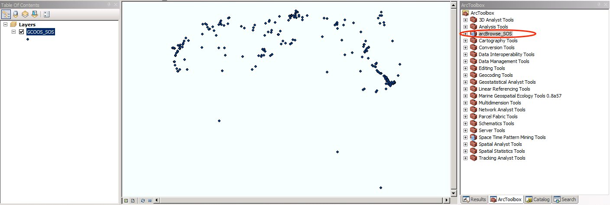

#arcBrowse_SOS.pyt

Currently IOOS suggests 3 SOS clients    (http://catalog.ioos.us/help/download/) to access SOS to retrieve information and data: Pyoos, the Environmental Data Connector (EDC) and 52n Sensor Web Client.

EDC works well with Data Integration Framework (DIF) SOS. However it doesn’t work with new IOOS-build SOS (IOOS SOS) that GCOOS and other 2 Regional Association have adopted.

This project will provide a python toolbox (pyoos-base) to access IOOS-SOS and create a layer for ArcMap.
Currently, pyoos collects only certain information: <a href="https://gist.github.com/otwn/7aa5ed6e03684edeca73">https://gist.github.com/otwn/7aa5ed6e03684edeca73</a> 

With ArcGIS Server SOS Extension developed by 52North and ESRI, it allows querying of observations, metadata about procedures (= sensors), as well as descriptions of features (of interest) observed by the sensors.


##Note
These utilities are a work in progress. They'll be continually updated and improved as time allows. 

##Requirements
This script uses ####Pyoos (http://github.com/ioos/pyoos). It can be installed with pip.
```
$ pip install pyoos
```
Note that I'm using Enthought and/or Anaconda python package manager and set it up to access them from ArcGIS (http://gis.stackexchange.com/questions/59012/how-to-access-esri-arcpy-modules-from-enthought-canopy/59144#59144).

##Utility
When you run "Add Toolbox" and select this pyt file, it will create a layer in C:/Temp folder and it will look like this.
